# 🧀💸CheeseFlow Mobile App

> **⚠️ Archived Project**
> This repository is a public archive of CheeseFlow Mobile. The project has been moved to a private repository for continued development. The backend API has also been made private following database migrations and infrastructure updates. This snapshot is shared for reference and portfolio purposes — the app is no longer actively maintained here.

**CheeseFlow** is a personal finance mobile application built with **React Native (Expo)**, **Tamagui**, **Apollo Client**, and **Zustand**. It helps users easily **track income and expenses**, **organize transactions**, and **generate insightful reports** to better understand their financial health.

## 🚀 Tech Stack

- 📱 **React Native (Expo)** — for building a smooth cross-platform mobile app
- 🎨 **Tamagui** — for performant, styled UI components
- 🌐 **Apollo Client** — for interacting with a GraphQL backend
- 🧠 **Zustand** — for simple and powerful state management

## 🔗 Backend Repository

This mobile application is powered by a backend API built with NestJS, GraphQL, PostgreSQL, and Drizzle ORM. The backend handles all business logic for tracking income, expenses, and generating reports.

> **Note:** The backend repository has been made private following infrastructure migrations. The link below may not be accessible.

👉 [CheeseFlow API Repository](https://github.com/boysimon10/cheeseflow-api) *(private)*

## 📱 Screenshots

  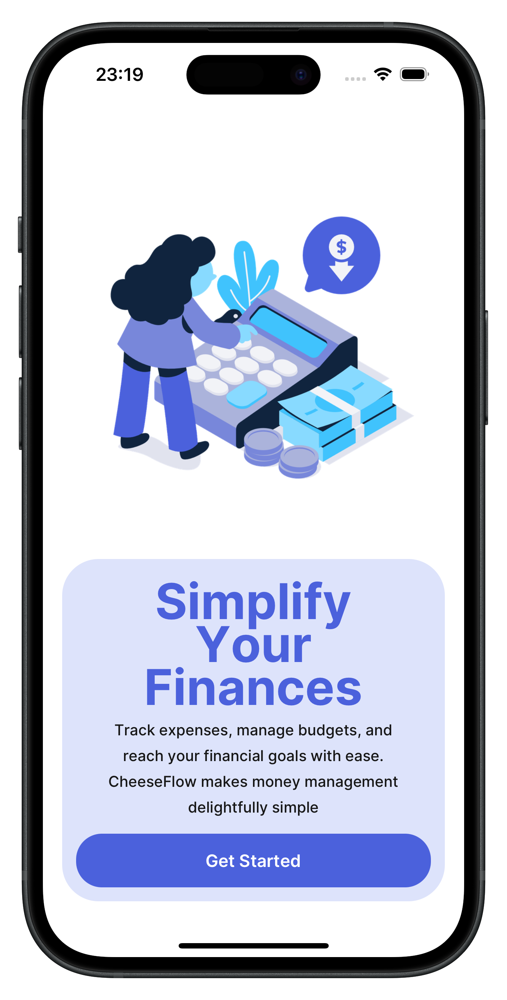
  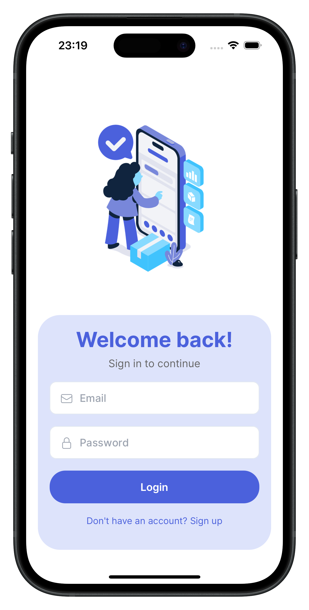
  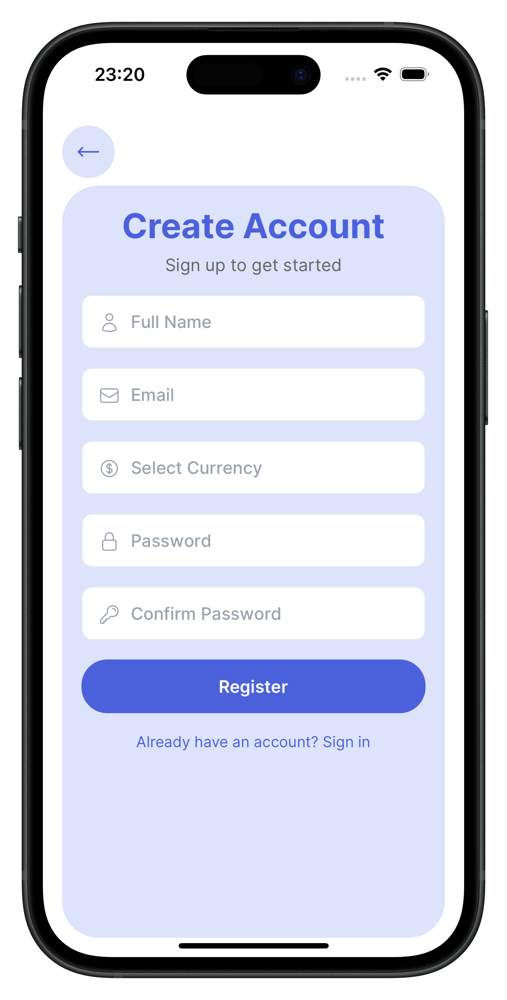
  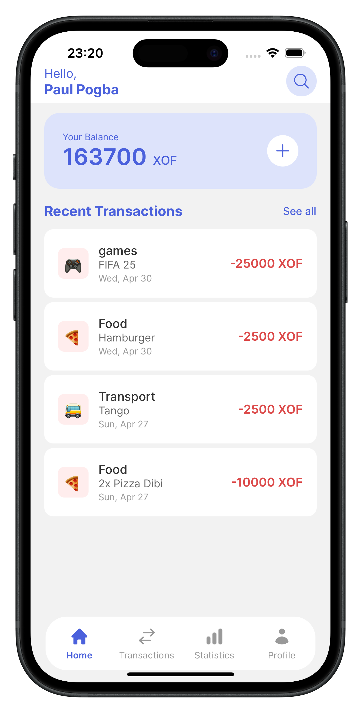
  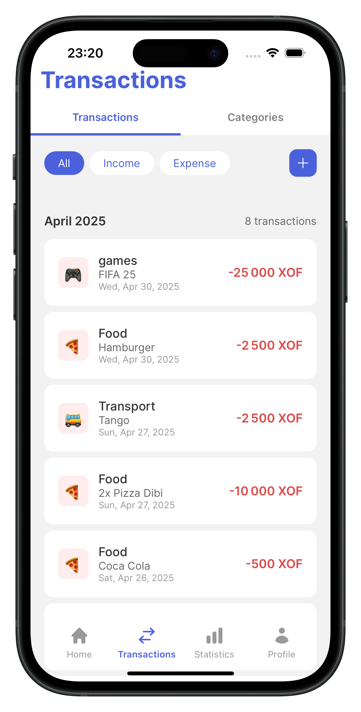
  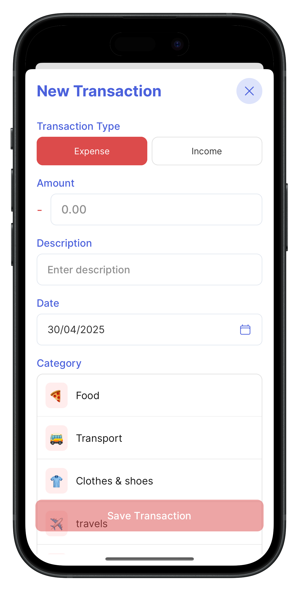
  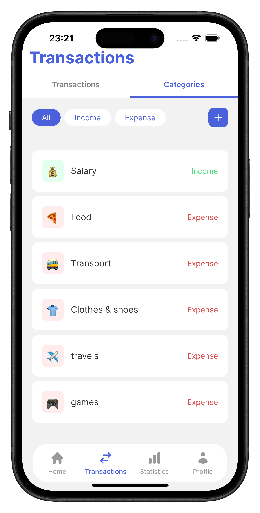
  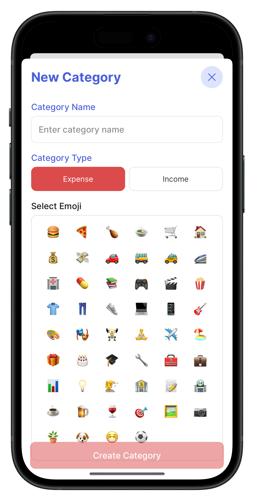
  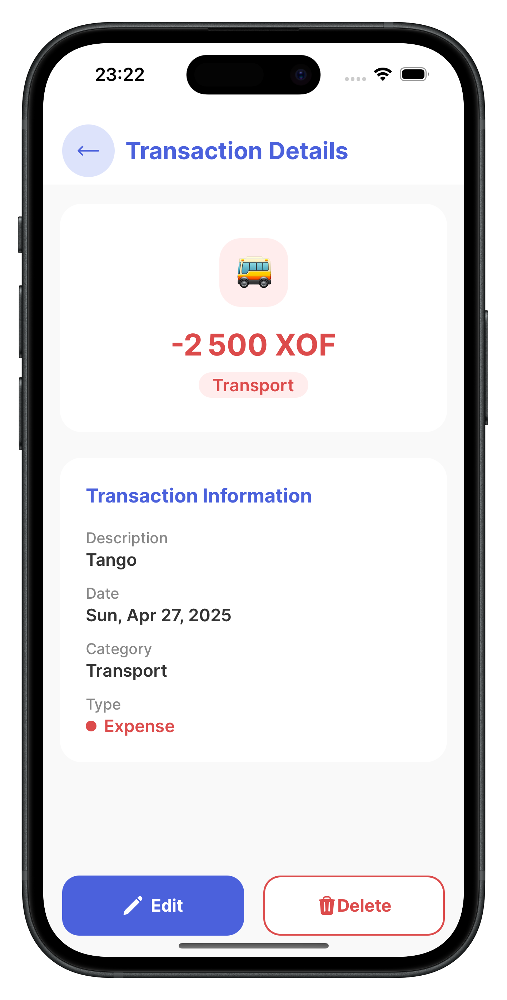
  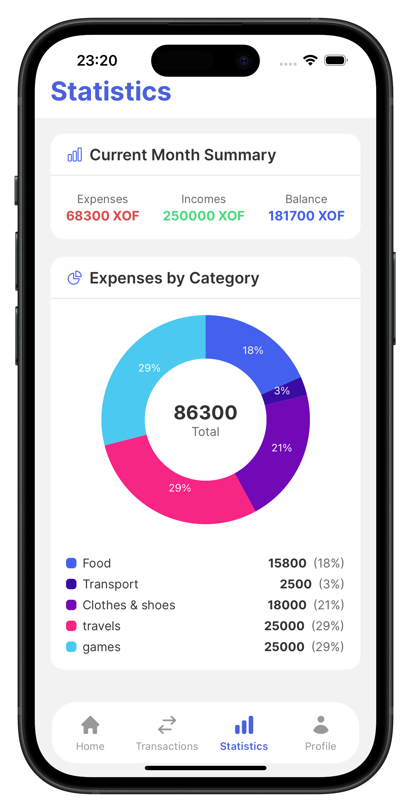
  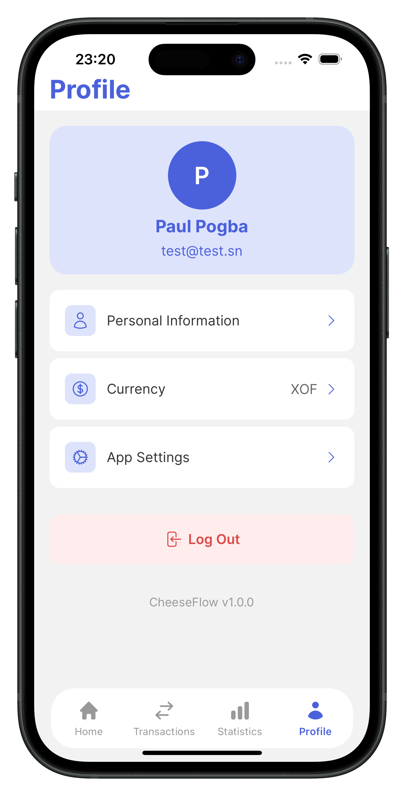

## 📲 Features

- **Secure Authentication**  
  Robust authentication system with JWT tokens and secure session management.

- **Add Transactions**  
  Log income and expenses with category, amount, date, and notes. Support for multiple currencies and custom categories.

- **Track Balance**  
  See your total balance updated in real-time with detailed breakdown by account and currency.

- **Monthly Overview**  
  Get a breakdown of how much you're spending or earning month-by-month with interactive charts and trends analysis.

- **Category Reports**  
  Visualize your transactions grouped by category with detailed statistics and spending patterns.

- **Smart Analytics**  
  Get insights about your spending habits and recommendations for better financial management.

- **Lightweight & Fast**  
  Designed with performance and simplicity in mind using Tamagui and Zustand.

## 🧠 What I Learned

- **State Management with Zustand**  
  Built a clean store architecture for global state handling with optimized re-renders and persistent storage.

- **GraphQL with Apollo Client**  
  Learned how to fetch, mutate, and cache data effectively with proper error handling and offline support.

- **Design Systems with Tamagui**  
  Created a consistent and scalable UI with styled components and tokens, implementing responsive layouts and animations.

- **TypeScript Best Practices**  
  Leveraged TypeScript for type-safe development with custom types and interfaces.

## 🔮 Future Improvements

- 🌙 Add dark mode and theme customization
- 🔒 Implement authentication and sync with cloud backend
- 🧾 Export reports as PDF or CSV
- 🔔 Add spending limit notifications
- 💳 Add debt tracking and management
- 📈 Add debt repayment planning and scheduling
- 📅 Add subscription management and recurring payments
- 💰 Add budget management with spending limits per category

## 🛠️ Known Technical Debt

These improvements were identified but will be addressed in the private continuation of the project:

- **GraphQL query optimization** — Some queries are unnecessarily fragmented or duplicated. Refactoring using fragments and nested relationships would reduce over-fetching and improve API efficiency.
- **Tamagui token adoption** — Theme values (colors, spacing, typography) are currently hardcoded in several places. A full migration to Tamagui's token-based theming system would improve maintainability and consistency.
- **Strict TypeScript type safety** — Parts of the codebase rely on loose or implicit typing. A stricter TypeScript configuration with well-defined types across the whole codebase is needed.

## 🤝 Contributing

This repository is archived and no longer actively maintained. Contributions are not expected, but feel free to fork the project for your own use.
