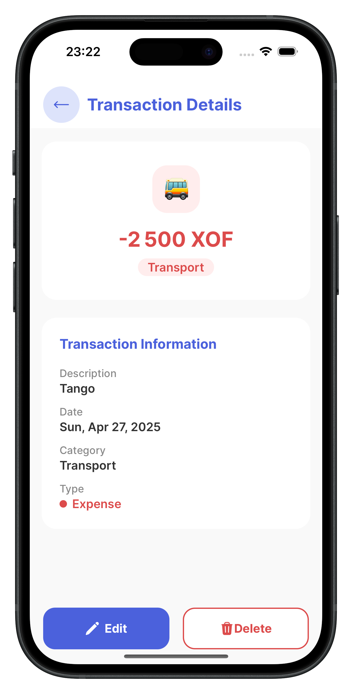

# 🧀💸CheeseFlow Mobile App

**CheeseFlow** is a personal finance mobile application built with **React Native (Expo)**, **Tamagui**, **Apollo Client**, and **Zustand**. It helps users easily **track income and expenses**, **organize transactions**, and **generate insightful reports** to better understand their financial health.

## 🚀 Tech Stack

- 📱 **React Native (Expo)** — for building a smooth cross-platform mobile app  
- 🎨 **Tamagui** — for performant, styled UI components  
- 🌐 **Apollo Client** — for interacting with a GraphQL backend  
- 🧠 **Zustand** — for simple and powerful state management  

## 🔗 Backend Repository

This mobile application is powered by a robust backend API built with NestJS, GraphQL, PostgreSQL, and TypeORM. The backend handles all business logic for tracking income, expenses, and generating reports.

👉 [View CheeseFlow API Repository](https://github.com/boysimon10/cheeseflow-api)

## 📱 Screenshots

<div style="display: flex; flex-direction: 'row';">
  
  
  
  
  
  
  
  
  
  
  
</div>

## 📲 Features

- **Secure Authentication**  
  Robust authentication system with JWT tokens and secure session management.

- **Add Transactions**  
  Log income and expenses with category, amount, date, and notes. Support for multiple currencies and custom categories.

- **Track Balance**  
  See your total balance updated in real-time with detailed breakdown by account and currency.

- **Monthly Overview**  
  Get a breakdown of how much you're spending or earning month-by-month with interactive charts and trends analysis.

- **Category Reports**  
  Visualize your transactions grouped by category with detailed statistics and spending patterns.

- **Smart Analytics**  
  Get insights about your spending habits and recommendations for better financial management.

- **Lightweight & Fast**  
  Designed with performance and simplicity in mind using Tamagui and Zustand.

## 🧠 What I Learned

- **State Management with Zustand**  
  Built a clean store architecture for global state handling with optimized re-renders and persistent storage.

- **GraphQL with Apollo Client**  
  Learned how to fetch, mutate, and cache data effectively with proper error handling and offline support.

- **Design Systems with Tamagui**  
  Created a consistent and scalable UI with styled components and tokens, implementing responsive layouts and animations.

- **TypeScript Best Practices**  
  Leveraged TypeScript for type-safe development with custom types and interfaces.

## 🔮 Future Improvements

- 🌙 Add dark mode and theme customization
- 🔒 Implement authentication and sync with cloud backend
- 🧾 Export reports as PDF or CSV
- 🔔 Add spending limit notifications
- 💳 Add debt tracking and management
- 📈 Add debt repayment planning and scheduling
- 📅 Add subscription management and recurring payments

## 🛠️ Running the App Locally

> ⚠️ **Important**: This mobile app requires the CheeseFlow backend API to be running. Please follow these steps in order:

1. **Set up the Backend first**
   - Clone and configure the backend repository from [CheeseFlow Backend Repository](https://github.com/boysimon10/cheeseflow-api)
   - Follow the backend setup instructions in its README
   - Make sure the backend server is running before starting the mobile app

2. **Clone the repository**  
   ```bash
   git clone https://github.com/boysimon10/cheeseflow-mobile.git
   cd cheeseflow
   ```

2. **Install dependencies**  
   ```bash
   npm install
   # or
   yarn install
   ```

3. **Start the development server**  
   ```bash
   npx expo start
   ```

4. **Open on your device**  
   Scan the QR code with the **Expo Go app** (available on iOS and Android) or run it on an emulator.

## 🤝 Contributing

Contributions are welcome! Feel free to:

1. Fork the project
2. Create a feature branch
3. Commit your changes
4. Push to the branch
5. Open a Pull Request